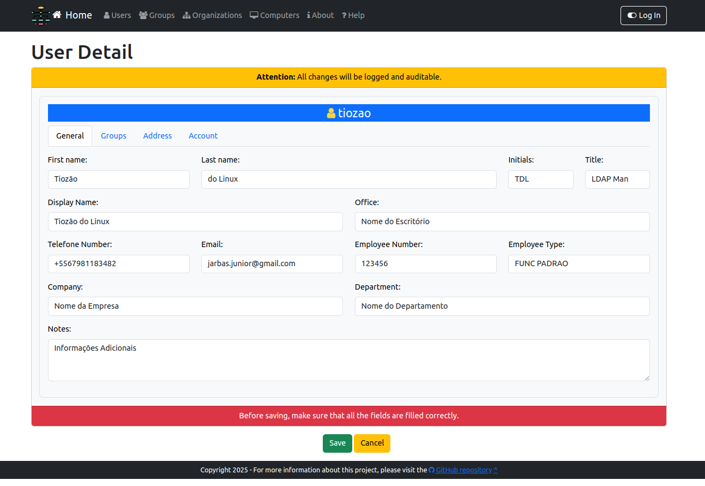

# What is GNU-ADMW

GNU-ADMW is an Active Directory Management Web in a GNU GENERAL PUBLIC LICENSE

# Introduction

This project is a Web Interface for Active Directory made using **Django** (https://www.djangoproject.com/) and **ms_active_directory** (https://ms-active-directory.readthedocs.io/) focusing on ease of use and simplicity provide by **Bootstrap** (https://getbootstrap.com/)

It's using the connecting user's credentials to connect to the directory and allow a variety of operations.

The goal is to be able to do most common directory operations directly through this web interface rather than have to rely on command tools or Windows interfaces.

It's compatible with both **Windows Active Directory** and **Samba4** domain controllers.

If you don't know how to install samba4 see https://wiki.tiozaodolinux.com/Guide-for-Linux/Active-Directory-With-Samba-4

# History

This project started in december 2024 with objetive of simplify the management of Users, Groups, Lists, Organizatinal Units

In my job we have the RH area with demands to NOC area create new Users, reset password Users, etc

The main objetive is RH area make yours needs without NOC area dependencies

# Install and run

```sh
# Download clone project
git clone https://github.com/jarbelix/GNU-ADMW.git
cd GNU-ADMW

# Create virtualenvironment
python -m venv .venv
. .venv/bin/activate

# Install dependencies
pip install -r requirements.txt

# Or install each one
pip install django ms_active_directory python-decouple python-dotenv crispy-bootstrap5 django-crispy-forms
```

## Setup Environment

Copy the env.example file to .env

```sh
cp env.example .env
```

## Initial testing

### Config .env

Udpate the settings to match your environment

```
# Active Directory config
AD_DOMAIN='seudominio.com.br'                       # your domain name
AD_SERVER='ldaps://dc01.${AD_DOMAIN}'               # your server in format ldap:// (without secure) or ldaps:// (with secure)
AD_ADMIN_USER='Administrator@${AD_DOMAIN}'          # you can use the userPrincipalName instead of the DN of the empowered user to change your AD
AD_ADMIN_PASSWORD='SuperSecretPassword@2024'        # your password

# CSV list attrs
AD_USER_ATTRS='cn,sn,title,description,physicalDeliveryOfficeName,telephoneNumber,givenName,displayName,department,company,name,sAMAccountName,userPrincipalName,mail,loginShell,objectGUID,objectSid'
AD_GROUP_ATTRS='cn,sn,description,name,sAMAccountName,member,objectGUID,objectSid'

# Base search
AD_BASE='DC=seudominio,DC=com,DC=br'                # your DN base
AD_BASE_USER='CN=Users,${AD_BASE}'                  # your DN base user
AD_BASE_GROUP='CN=Groups,${AD_BASE}'                # your DN base group

# Group restrictions
AD_GROUP_REQUIRED='CN=Turma da Monica,${AD_BASE_USER}'  # your DN group with the user MUST be in
AD_GROUP_DENIED='CN=Disabled,${AD_BASE_GROUP}'          # your DN group with the user NOT may be in
```

### Connection to Active Directory

```sh
python test-active-directory.py
```

#### Output example
```
# Retrieve the configuration parameters:
# Connect with AD_DOMAIN - tiozaodolinux.com at AD_SERVER - ldaps://dc01.tiozaodolinux.com with Administrator@tiozaodolinux.com
# Find user by name="tiozao"
# Display user info
================================================================================
OBJECT DN: CN=tiozao,CN=Users,DC=tiozaodolinux,DC=com
================================================================================
{
    "objectClass": [
        "top",
        "person",
        "organizationalPerson",
        "user"
    ],
    "cn": "tiozao",
    "sn": "do Linux",
    "title": "Título do Cargo",
    "description": [
        "Descrição Opcional"
    ],
    "physicalDeliveryOfficeName": "Endereço Completo",
    "telephoneNumber": "+55 67 9 81183482",
    "givenName": "Tiozão",
    "displayName": "Tiozão do Linux",
    "department": "Nome do Departamento",
    "company": "Nome da Empresa",
    "name": "tiozao",
    "objectGUID": "{ec206896-e6e2-4edc-a4b0-6accc8e3e981}",
    "objectSid": "S-1-5-21-253206946-2420641807-3433596073-1124",
    "sAMAccountName": "tiozao",
    "userPrincipalName": "tiozao@tiozaodolinux.com",
    "loginShell": "/bin/bash",
    "mail": "jarbelix@gmail.com"
}
--------------------------------------------------------------------------------
# Find group by name="Turma da Monica"
# Display group info
================================================================================
OBJECT DN: CN=Turma da Monica,CN=Users,DC=tiozaodolinux,DC=com
================================================================================
{
    "objectClass": [
        "top",
        "group"
    ],
    "cn": "Turma da Monica",
    "description": [
        "Grupo de Usuários da Turma da Mônica"
    ],
    "name": "Turma da Monica",
    "objectGUID": "{5eecc0e4-5091-4c2b-9ef8-c534feac9078}",
    "objectSid": "S-1-5-21-253206946-2420641807-3433596073-1103",
    "sAMAccountName": "Turma da Monica",
    "member": [
        "CN=rosinha,OU=Producao,DC=tiozaodolinux,DC=com",
        "CN=monica,OU=RH,DC=tiozaodolinux,DC=com",
        "CN=anjinho,OU=Financeiro,DC=tiozaodolinux,DC=com",
        "CN=rolo,OU=RH,DC=tiozaodolinux,DC=com",
        "CN=carminha.frufru,OU=Producao,DC=tiozaodolinux,DC=com",
        "CN=magali,OU=Producao,DC=tiozaodolinux,DC=com",
        "CN=marina,OU=TI,DC=tiozaodolinux,DC=com",
        "CN=cebolinha,OU=Financeiro,DC=tiozaodolinux,DC=com",
        "CN=capitao.feio,OU=Comercial,DC=tiozaodolinux,DC=com",
        "CN=rita.najura,OU=Logistica,DC=tiozaodolinux,DC=com",
        "CN=franjinha,OU=Logistica,DC=tiozaodolinux,DC=com",
        "CN=horacio,OU=TI,DC=tiozaodolinux,DC=com",
        "CN=piteco,OU=Comercial,DC=tiozaodolinux,DC=com",
        "CN=ze.vampir,OU=Contabil,DC=tiozaodolinux,DC=com",
        "CN=dudu,OU=RH,DC=tiozaodolinux,DC=com",
        "CN=xaveco,OU=TI,DC=tiozaodolinux,DC=com",
        "CN=seu.cebola,OU=Presidente,DC=tiozaodolinux,DC=com",
        "CN=chico.bento,OU=Comercial,DC=tiozaodolinux,DC=com",
        "CN=juca,OU=Logistica,DC=tiozaodolinux,DC=com",
        "CN=cascao,OU=Contabil,DC=tiozaodolinux,DC=com"
    ]
}
--------------------------------------------------------------------------------
```

### Start application
```sh

python manage.py makemigrations

python manage.py migrate

export DJANGO_SUPERUSER_PASSWORD=SuperSecretPassword@2024

python manage.py createsuperuser --username djangoadmin --email djangoadmin@seudominio.com.br --noinput

python manage.py runserver

```
### Screenshots



### Testing

Starting development server at http://127.0.0.1:8000/

Try logging in with your **Active Directory User** that belongs to the **Required Group** and not to the **Denied Group**

Check the logs in the console


